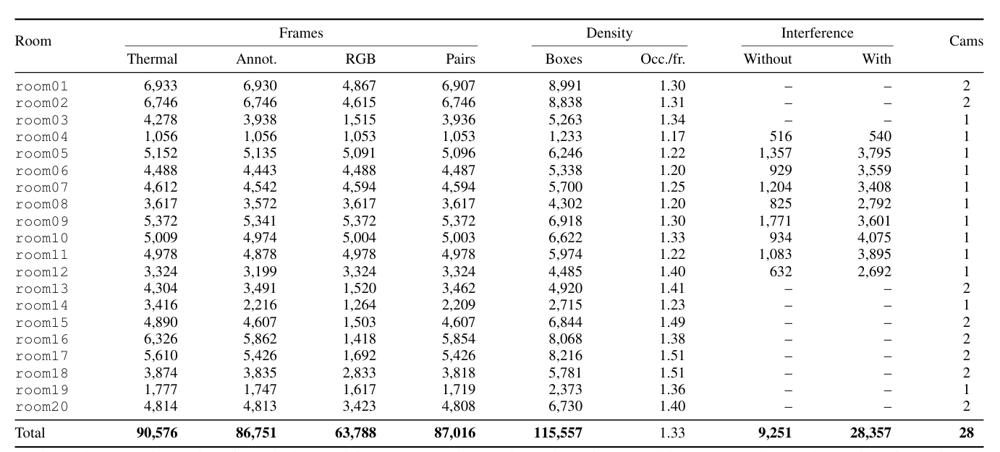
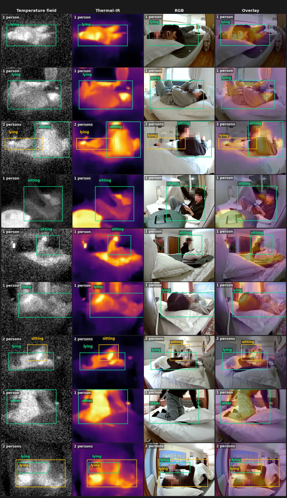
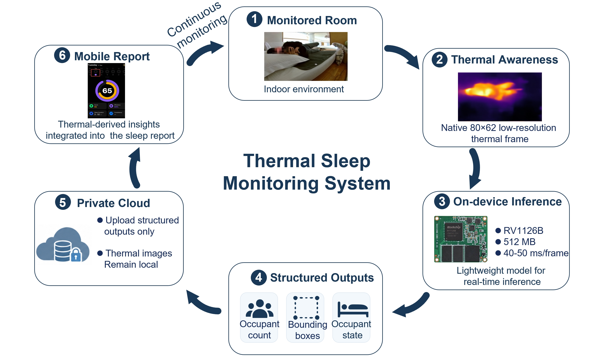

# RGBT

## Introduction

The code implementation for the paper:Towards Privacy-Preserving Thermal Human Perception from Dataset to Deployment.


## Installation

Download or clone the repository.

```shell
git clone https://github.com/kailaisun/RGBT.git
cd RGBT
```


### Environment Installation 
We recommend using Conda ([Miniconda](https://docs.conda.io/projects/miniconda/en/latest/index.html)) for installation. 


#### Dataset summary





Some examples:



We publish part of the thermal images and annotations on [Hugging Face](https://huggingface.co/skl24/RGBT).


#### Deployment




## Released models

We release one model per task, together with minimal inference code. Weights live
on [Hugging Face](https://huggingface.co/skl24/RGBT); each folder below contains a
self-contained `infer.py`.

| Task | Method | Folder | Weights (Hugging Face) | Headline metric |
|---|---|---|---|---|
| Infrared person-state detection (4 states) | YOLO11s | [`yolo11/`](yolo11) | `yolo11/weights/best.pt` | mAP50 0.789 / mAP50-95 0.505 |
| Infrared person counting | ResNet18 | [`resnet18/`](resnet18) | `resnet18/weights/best.pt` | accuracy 0.8165 / macro-F1 0.8048 |
| RGB to thermal field | U-Net | [`unet_rgb2t/`](unet_rgb2t) | `unet_rgb2t/weights/checkpoint.pt` | MAE 0.654 C / R2 0.923 |
| Infrared to RGB | BBDM | [`bbdm_ir2rgb/`](bbdm_ir2rgb) | `bbdm_ir2rgb/weights/last_model.pth` | PSNR 19.47 / SSIM 0.797 / FID 20.39 |

Only the thermal-infrared image is used as input for the detection and
counting models; RGB is never fed to them.

### Download the weights

```shell
pip install "huggingface_hub[cli]"
hf download skl24/RGBT --local-dir checkpoints
```

### Run inference

```shell
# 4-state person detection
python yolo11/infer.py    --weights checkpoints/yolo11/weights/best.pt             --source ir.png
# person counting
python resnet18/infer.py  --weights checkpoints/resnet18/weights/best.pt           --source ir.png
# RGB -> thermal field
python unet_rgb2t/infer.py --weights checkpoints/unet_rgb2t/weights/checkpoint.pt  --source rgb.jpg
# IR -> RGB
python bbdm_ir2rgb/infer.py --weights checkpoints/bbdm_ir2rgb/weights/last_model.pth \
    --source ir.png --output rgb.png
```

See each folder's `README.md` for the model details, training setup and
held-out test numbers.


## Citation


## License

The repository is licensed under the [MIT license](LICENSE).

## Contact Us

If you have other questions❓, please contact us in time 👬
